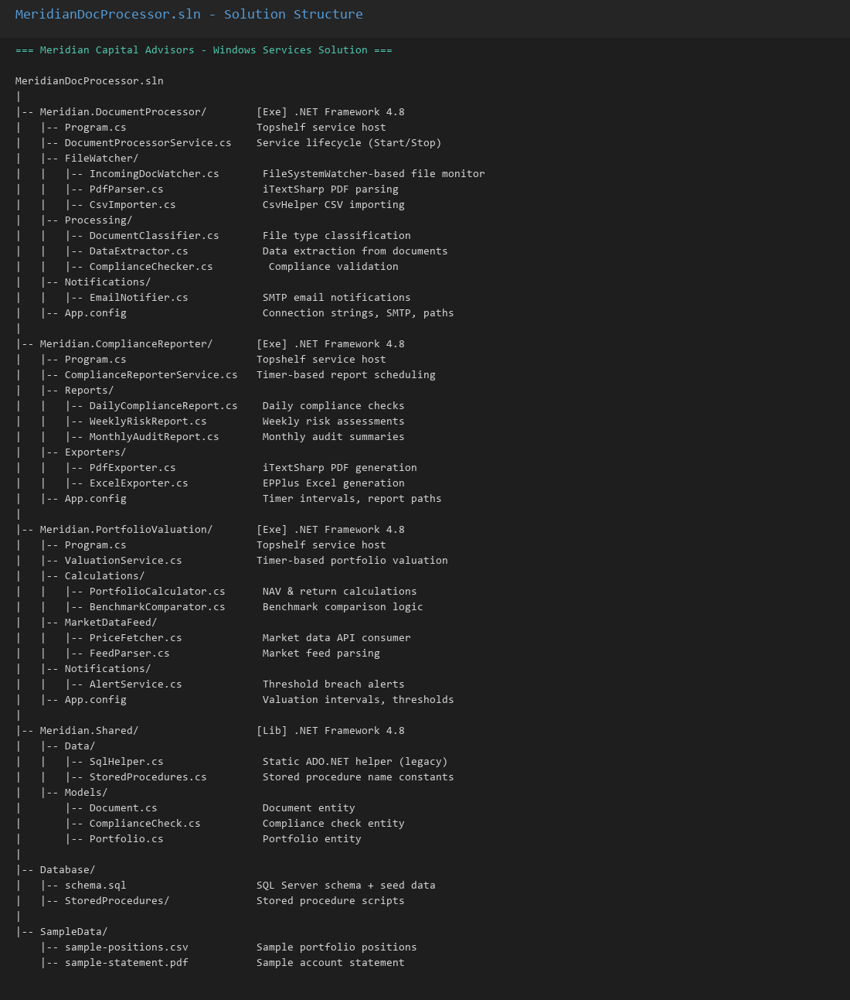
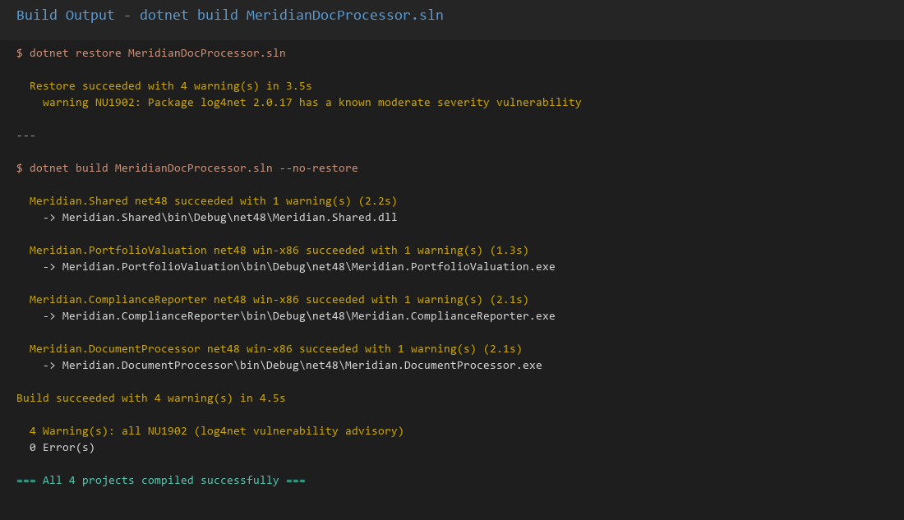
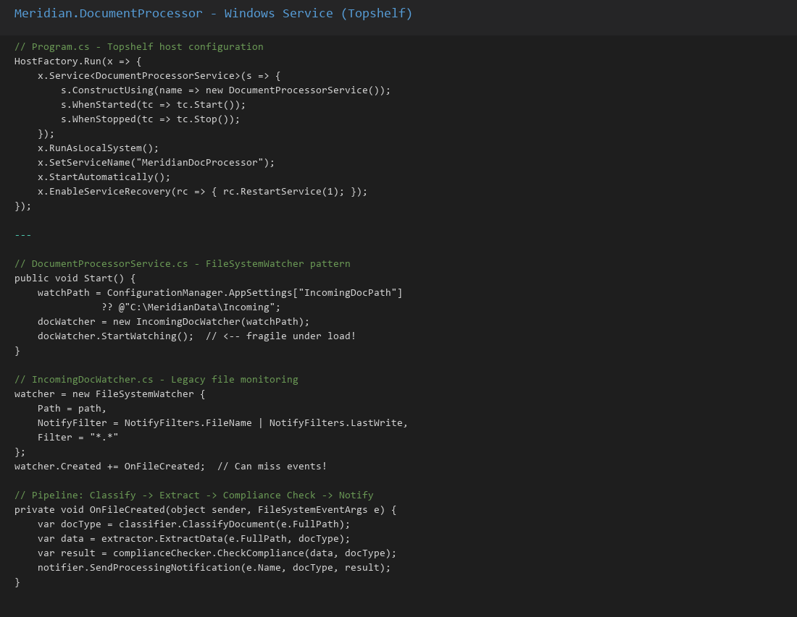
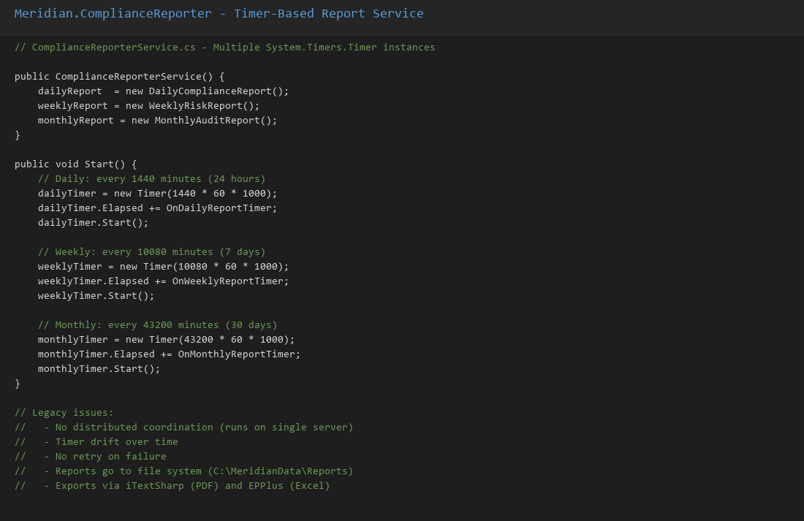
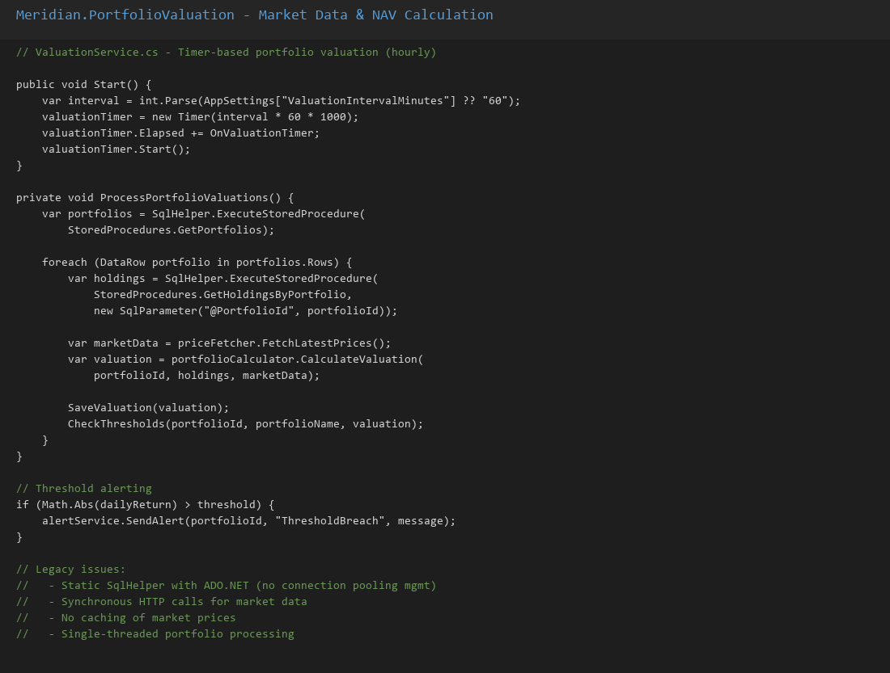
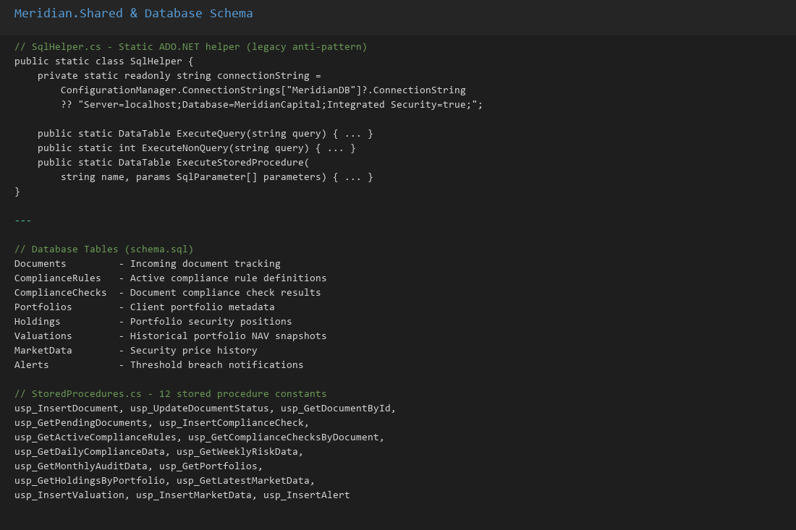
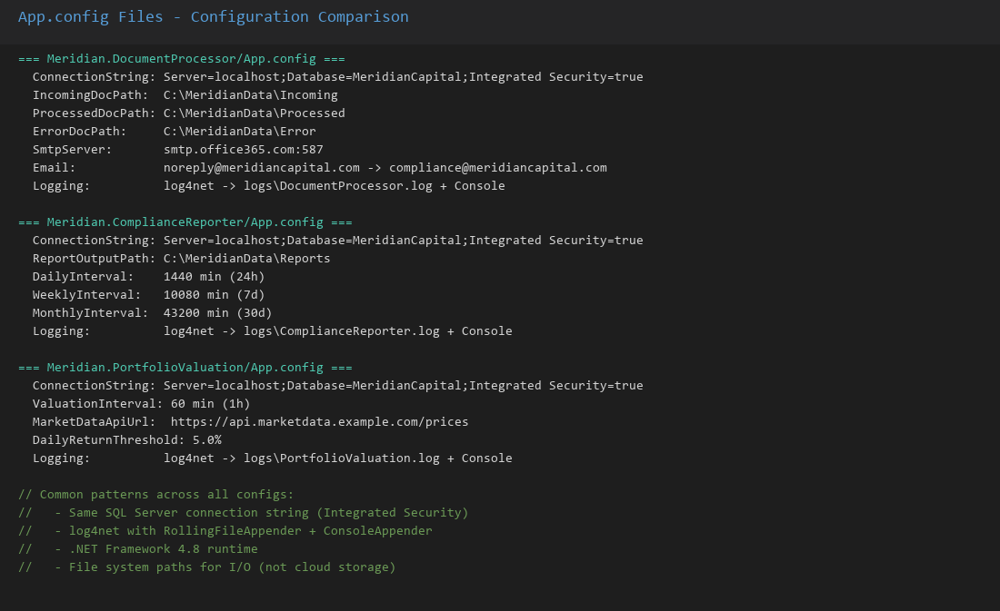
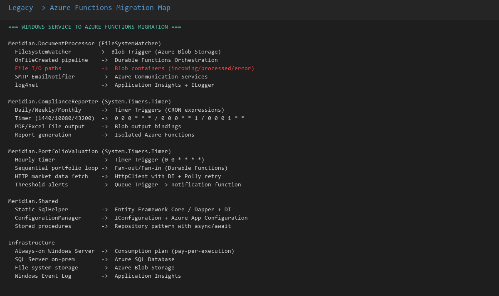

## Legacy Application Overview

Meridian Capital Advisors runs three monolithic .NET Framework 4.8 Windows Services for financial document processing, compliance reporting, and portfolio valuation. These always-on services use FileSystemWatcher (which misses events under load), System.Timers.Timer (with no distributed coordination), and static ADO.NET helpers — all targeted for migration to event-driven Azure Functions.

### Solution Architecture

The Visual Studio solution contains three Windows Service projects plus a shared library, organized in a classic .NET Framework structure with ServiceBase-derived entry points.



### Build Verification

The legacy solution builds successfully under .NET Framework 4.8, confirming all dependencies and project references are intact before beginning the migration.



### Document Processor Service

The DocumentProcessor service watches a file system directory for incoming financial documents, parses them, and stores results in SQL Server. Under load, the FileSystemWatcher can silently miss events.



### Compliance Reporter Service

The ComplianceReporter runs on a timer schedule, generating regulatory compliance reports from SQL Server data and distributing them via SMTP.



### Portfolio Valuation Service

The PortfolioValuation service performs scheduled portfolio recalculations, aggregating market data and computing NAV figures for client accounts.



### Shared Library & Database

The shared library provides common data access, models, and database schema used across all three services.



### Configuration Comparison

Each service has its own App.config with connection strings, timer intervals, and file paths — configuration sprawl that will be consolidated into Azure Function app settings.



### Migration Mapping

The migration mapping shows how each legacy Windows Service component maps to its Azure Functions equivalent: FileSystemWatcher → Blob triggers, Timers → Timer triggers, MSMQ → Queue triggers.



---

## Screenshots

### Solution Structure


### Build Output


### Document Processor Service


### Compliance Reporter Service


### Portfolio Valuation Service


### Shared Library & Database Schema


### App.config Comparison


### Migration Mapping (Legacy → Azure Functions)


---

## Solution Walkthrough

This solution was built step-by-step using **GitHub Copilot CLI** (`gh copilot`). Each step is tagged in the `solution-final` branch. All CLI outputs are captured in `assets/outputs/`.

### Branch & Tags

| Branch | Description |
|--------|-------------|
| `solution-final` | Complete solution with all 8 steps |

| Tag | Commit | Description |
|-----|--------|-------------|
| `step-01-explore-and-map` | Step 01 | Explore legacy services and create migration mapping |
| `step-02-blob-functions` | Step 02 | Blob-triggered document processing functions |
| `step-03-queue-pipeline` | Step 03 | Queue pipeline (extract → compliance → notify) |
| `step-04-timer-functions` | Step 04 | Timer functions for reports and portfolio valuation |
| `step-05-durable-functions` | Step 05 | Durable Functions orchestration with retry |
| `step-06-monitoring` | Step 06 | Application Insights monitoring and health checks |
| `step-07-deploy` | Step 07 | Bicep infrastructure and GitHub Actions CI/CD |
| `step-08-final-review` | Step 08 | Build verification and Functions README |

### Step-by-Step CLI Commands

**Step 1 — Explore & Map Windows Services**
```bash
gh copilot -- -p "Analyze the three Windows Services and create a migration mapping document at assets/migration-mapping.md" --allow-all-tools --yolo
```
Output: `assets/outputs/step-01-explore-and-map.txt`

**Step 2 — Build Blob-Triggered Functions**
```bash
gh copilot -- -p "Create Azure Functions v4 project (.NET 9 isolated worker) with BlobTrigger for document processing and QueueTrigger for classification" --allow-all-tools --yolo
```
Output: `assets/outputs/step-02-blob-functions.txt`

**Step 3 — Build Queue Pipeline**
```bash
gh copilot -- -p "Add queue-based pipeline: ExtractDataFunction, ComplianceCheckFunction, NotifyFunction with Azure Communication Services" --allow-all-tools --yolo
```
Output: `assets/outputs/step-03-queue-pipeline.txt`

**Step 4 — Build Timer Functions**
```bash
gh copilot -- -p "Add TimerTrigger functions for compliance reports (daily/weekly/monthly), on-demand HTTP reports, portfolio valuation, market data refresh, and alerts" --allow-all-tools --yolo
```
Output: `assets/outputs/step-04-timer-functions.txt`

**Step 5 — Add Durable Functions Orchestration**
```bash
gh copilot -- -p "Add Durable Functions orchestrator for multi-step document processing with fan-out/fan-in and retry policies" --allow-all-tools --yolo
```
Output: `assets/outputs/step-05-durable-functions.txt`

**Step 6 — Add Monitoring**
```bash
gh copilot -- -p "Add Application Insights telemetry, TelemetryService, HealthCheckFunction, and structured logging" --allow-all-tools --yolo
```
Output: `assets/outputs/step-06-monitoring.txt`

**Step 7 — Deploy Infrastructure**
```bash
gh copilot -- -p "Create Bicep templates (Function App, Storage, SQL, App Insights) and GitHub Actions deploy workflow" --allow-all-tools --yolo
```
Output: `assets/outputs/step-07-deploy.txt`

**Step 8 — Final Review**
```bash
gh copilot -- -p "Build verification and create Meridian.Functions/README.md with function catalog" --allow-all-tools --yolo
```
Output: `assets/outputs/step-08-final-review.txt`

### Functions Created

| Function | Trigger | Schedule/Queue/Container | Service Replaced |
|----------|---------|--------------------------|------------------|
| ProcessDocument | Blob | `incoming-documents` | DocumentProcessor FileWatcher |
| ClassifyDocument | Queue | `classification-queue` | DocumentClassifier |
| ExtractData | Queue | `extraction-queue` | DataExtractor, PdfParser, CsvImporter |
| ComplianceCheck | Queue | `compliance-queue` | ComplianceChecker |
| Notify | Queue | `notification-queue` | EmailNotifier → Azure Comms |
| DailyComplianceReport | Timer | `0 0 18 * * *` | DailyComplianceReport |
| WeeklyRiskReport | Timer | `0 0 9 * * 5` | WeeklyRiskReport |
| MonthlyAuditReport | Timer | `0 0 6 1 * *` | MonthlyAuditReport |
| OnDemandReport | HTTP | `POST /api/reports` | New capability |
| PortfolioValuation | Timer | `0 */15 9-16 * * 1-5` | PortfolioCalculator |
| MarketData | Timer | Market hours | PriceFetcher |
| Alert | Queue | `alert-queue` | AlertService |
| DocumentOrchestrator | Durable | Orchestrator | New (pipeline) |
| DocumentActivities | Durable | Activities | New (pipeline) |
| OrchestratorStarter | HTTP | `POST /api/orchestrate` | New (pipeline) |
| HealthCheck | HTTP | `GET /api/health` | New (monitoring) |
